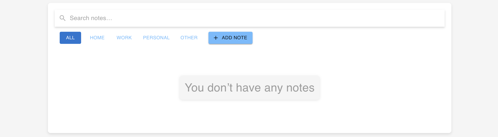

# Smart Notes Organizer

A web application for creating, organizing, and managing your notes.

## Table of Contents

- [Features](#features)
- [Technologies Used](#technologies-used)
- [Prerequisites](#prerequisites)
- [Installation](#installation)
- [Configuration](#configuration)
- [Running the Application](#running-the-application)
- [Testing](#testing)
- [AI Features](#ai-features)
- [Contributing](#contributing)
- [License](#license)

## Features

- **Create Notes:** Easily add new notes with titles and descriptions.
- **Search Notes:** Quickly find notes by title or description.
- **Edit Notes:** Modify existing notes.
- **Delete Notes:** Remove notes you no longer need.
- **Automatic Categorization (AI-Powered):** The application uses AI to automatically suggest categories for your notes.
- **Summarization (AI-Powered):** Long notes are automatically summarized to provide a quick overview.
- **Responsive Design:** The application is designed to work seamlessly on desktops, tablets, and mobile devices.
- **SQLite Database:** Notes are stored in a local SQLite database for persistence.

## Technologies Used

- **Frontend:**
  - React
  - Redux Toolkit
  - Material UI (MUI)
  - React Testing Library
  - Jest
- **Backend:**
  - Node.js
  - Express
  - SQLite
  - `sqlite3` Node.js package
  - CORS
- **AI Features:**
  - Hugging Face Inference API
  - `@xenova/transformers` (Initially, but now using the API)

## Prerequisites

Before you begin, ensure you have the following installed:

- **Node.js:** (Version 16 or higher recommended) - [https://nodejs.org/](https://nodejs.org/)
- **npm:** (Usually comes with Node.js) - [https://www.npmjs.com/](https://www.npmjs.com/)
- **Git:** (For cloning the repository) - [https://git-scm.com/](https://git-scm.com/)

## Installation

1.  **Clone the Repository:**

    ```bash
    git clone <github.com/Rensabir/AiNotes>
    cd AiNotes/note
    ```
    
2.  **Install Dependencies:**

    - **Frontend:**

      ```bash
      cd note  # Navigate to the frontend directory
      npm install
      ```

    - **Backend:**

      ```bash
      cd server # Navigate to the backend directory
      npm install
      ```

## Configuration

1.  **Hugging Face API Key:**

    - Sign up for a Hugging Face account at [https://huggingface.co/](https://huggingface.co/).
    - Go to your profile settings and find your API key.
    - **Frontend:**

      - Create a `.env` file in the `note/` directory.
      - Add your Hugging Face API key to the `.env` file:

        ```
        REACT_APP_HUGGING_FACE_API_KEY=YOUR_HUGGING_FACE_API_KEY
        ```

        Replace `YOUR_HUGGING_FACE_API_KEY` with your actual API key.

    - **Backend:** (If you were to use the API from the backend)

      - Create a `.env` file in the `server/` directory.
      - Add your Hugging Face API key to the `.env` file:

        ```
        HUGGING_FACE_API_KEY=YOUR_HUGGING_FACE_API_KEY
        ```

        Replace `YOUR_HUGGING_FACE_API_KEY` with your actual API key.

2.  **Database Configuration:**

    - The application uses a local SQLite database named `notes.db`. The database file will be created automatically in the `server/` directory when you run the backend.
    - No further configuration is required for the database.

## Running the Application

1.  **Start the Backend Server:**

    ```bash
    cd server
    node server.js
    ```

    This will start the backend server on port 5000 (or the port specified in your `server.js` file).

2.  **Start the Frontend Development Server:**

    ```bash
    cd note
    npm start
    ```

    This will start the frontend development server and open the application in your browser.

## Testing

1.  **Run Frontend Tests:**

    ```bash
    cd note
    npm test
    ```

    This will run the Jest unit tests for your React components.

## AI Features

The application uses the Hugging Face Inference API to provide the following AI-powered features:

- **Automatic Categorization:** The application uses the `Xenova/distilbert-base-cased` model to automatically suggest categories for your notes.
- **Summarization:** The application uses the `Xenova/distilbart-cnn-12-6` model to automatically summarize long notes.

**Note:** The performance of these features depends on the quality of the Hugging Face Inference API and the specific models being used.




